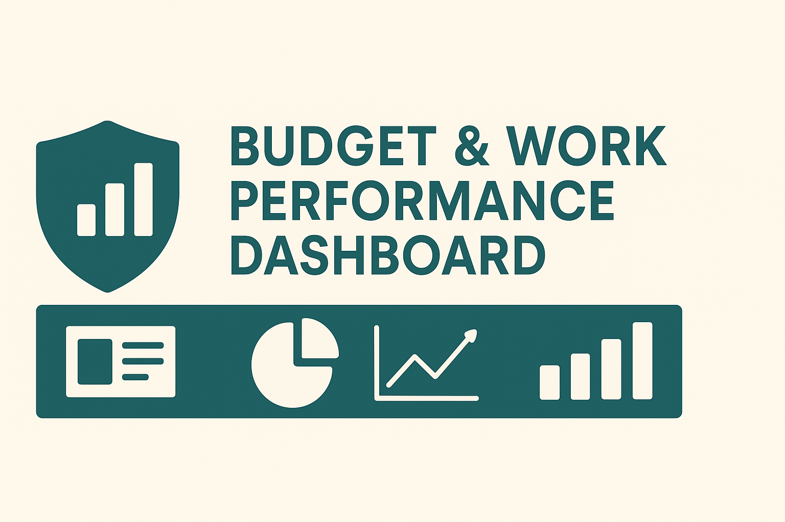
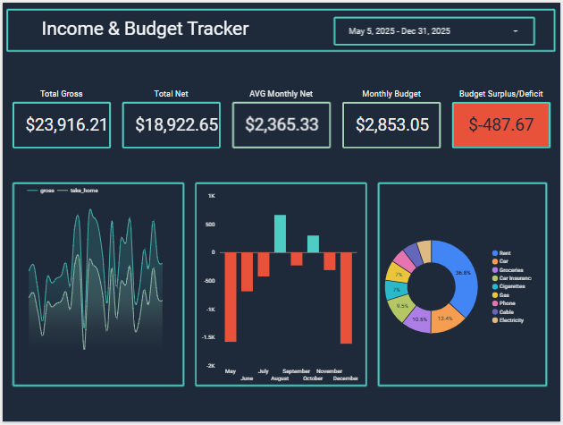
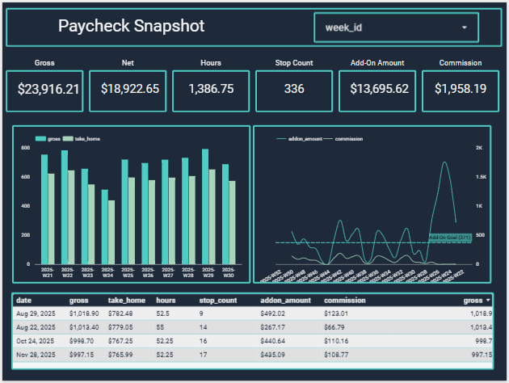
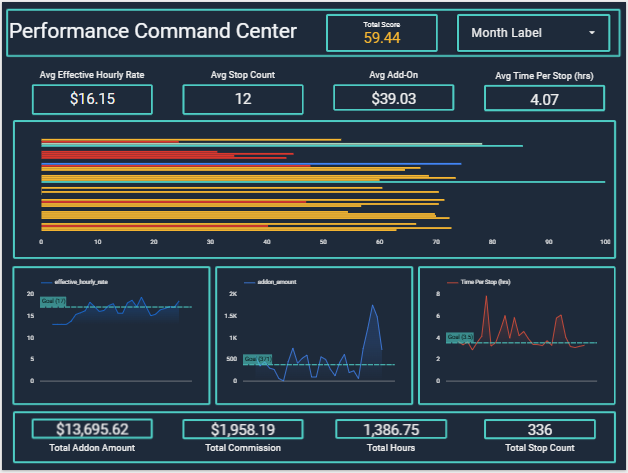
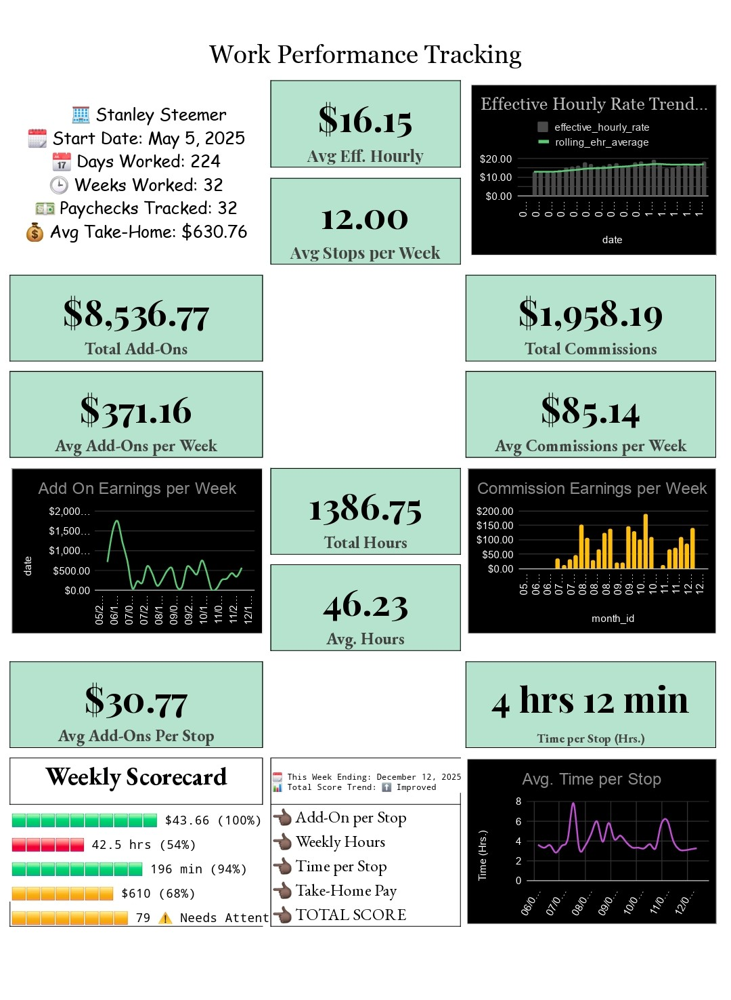

<!-- ===================== -->
<!--        COVER          -->
<!-- ===================== -->


# 📊 Budget & Work Performance Dashboard  
*A full analytics system built with Google Sheets, Google Apps Script, and automated KPI logic.*

This project transforms raw weekly paystub data into a complete **financial + operations-performance dashboard**, including forecasting, KPI scoring, visual analytics, and structured data pipelines ready for **SQL, Looker Studio, Tableau, Power BI, or Python**.

---

## 📌 Project Overview

This dashboard combines **personal income tracking**, **monthly budgeting**, and **Operations performance metrics** into one unified analytics system.

It includes:

- Automated **weekly ingestion** of paystub data  
- A **KPI engine** for performance scoring  
- **Monthly income vs expense** reporting  
- **Rolling averages** and **4-Pay Forecasting**  
- Trend charts for income, hours, add-ons, and commissions  
- A fully structured data layer designed for **SQL warehousing & BI tools**

<!-- ===================== -->
<!--        PREVIEW        -->
<!-- ===================== -->


<!-- ===================== -->
<!--        PREVIEW        -->
<!-- ===================== -->


<!-- ===================== -->
<!--        PREVIEW        -->
<!-- ===================== -->


📄 **Looker Studio Dashboard PDF Preview**  
👉 [Operations Performance & KPI Dashboard.PDF](https://github.com/visualkirby/Budget-Performance-Dashboard/blob/main/Operations_Performance_%26_KPI_Dashboard.pdf)

---

## 🧩 Features

### 📅 Personal Finance Metrics
- Avg Monthly Income  
- 3-Month Rolling Avg  
- Total Gross & Take-Home  
- Budget vs Actual Spending  
- Monthly Net Income  
- Category Breakdown (Rent, Groceries, Gas, etc.)

### 🧰 Work Performance Metrics
- Hours Worked  
- Stops per Week  
- Add-On Amounts  
- Commission Earned  
- Time per Stop (hrs / min)  
- Effective Hourly Rate  
- Weekly Scorecard with Color-Coded Performance

### 📈 Forecasting & Trends
- 4-Pay Forecast (Gross + Net)  
- 3-Month Rolling Forecast  
- Effective Hourly Rate Trend  
- Add-On Earnings Trend  
- Commission Earnings Trend  
- Avg Time per Stop Trend

### ⚙ Automation Layer
- Google Apps Script OCR parsing  
- Data cleaning + processing logs  
- Weekly processing confirmation  
- Bonus week flags  
- Structured date logic (`week_id`, `month_id`, `quarter_id`, `year`)

---

## 🧠 Data Pipeline

### 1️⃣ Input Layer (Raw Pay Data)
From weekly paystubs:
- Date  
- Gross Pay  
- Take-Home Pay  
- Hours  
- Add-On Amount  
- Stop Count  
- Commission  
- Time per Stop  
- Apps Script log URLs  

### 2️⃣ Processing Layer
Calculates:
- Add-On per Stop  
- Effective Hourly Rate  
- Time per Stop (hr/min)  
- Weekly Performance KPIs  
- Forecast metrics  
- Rolling averages  

### 3️⃣ Analytics Layer
Powers dashboards:
- Monthly views  
- Weekly scorecards  
- Trend charts  
- Summary KPIs  
- Variance vs goals  

### 4️⃣ Output Layer
- Dashboard PDF  
- PNG dashboard visuals  
- CSV exports  
- Clean structured tables for SQL / BI tools  

---

📄 **Google Sheets Dashboard PDF Preview**  
👉 [Stanley Steemer Work Performance.PDF](https://github.com/visualkirby/Budget-Performance-Dashboard/blob/main/Stanley%20Steemer%20Work%20Performance.PDF)

<!-- ===================== -->
<!--        PREVIEW        -->
<!-- ===================== -->


---

📄 **Excel Dashboard**  
👉 [Stanley Steemer Work Performance.xlsx](https://github.com/visualkirby/Budget-Performance-Dashboard/blob/main/Stanley%20Steemer%20Work%20Performance.xlsx)

## 🖼 Dashboard Visuals

| Metric | File |
|------|------|
| Gross vs Take-Home | https://github.com/visualkirby/Budget-Performance-Dashboard/blob/main/Gross_vs_Take_Home.png |
| Monthly Net Income | https://github.com/visualkirby/Budget-Performance-Dashboard/blob/main/Monthly_Net_Income.png |
| Monthly Forecast | https://github.com/visualkirby/Budget-Performance-Dashboard/blob/main/Monthly_Forecast.png |
| Add-On Earnings | https://github.com/visualkirby/Budget-Performance-Dashboard/blob/main/Add_On_Earnings_per_Week.png |
| Commission Trend | https://github.com/visualkirby/Budget-Performance-Dashboard/blob/main/Commission_Earning_per_Week.png |
| Effective Hourly Rate | https://github.com/visualkirby/Budget-Performance-Dashboard/blob/main/Effective_Hourly_Rate_Trend.png |
| Weekly Scorecard | https://github.com/visualkirby/Budget-Performance-Dashboard/blob/main/Weekly_Scorecard.png |

---

## 📂 Data Exports

| Dataset | Link |
|------|------|
| Raw Pay | https://github.com/visualkirby/Budget-Performance-Dashboard/blob/main/Raw_Pay.csv |
| Paychecks | https://github.com/visualkirby/Budget-Performance-Dashboard/blob/main/Paychecks.csv |
| Budget | https://github.com/visualkirby/Budget-Performance-Dashboard/blob/main/Budget.csv |
| Budget Plan | https://github.com/visualkirby/Budget-Performance-Dashboard/blob/main/Budget_Plan.csv |
| Income | https://github.com/visualkirby/Budget-Performance-Dashboard/blob/main/Income.csv |
| Scorecard | https://github.com/visualkirby/Budget-Performance-Dashboard/blob/main/Scorecard.csv |
| Derived Metrics | https://github.com/visualkirby/Budget-Performance-Dashboard/blob/main/Derived.csv |

---

## 📂 Formulas & Scripts

| File | Link |
|------|------|
| Formula Export | https://github.com/visualkirby/Budget-Performance-Dashboard/blob/main/FORMULA_EXPORT.csv |
| Apps Script | https://github.com/visualkirby/Budget-Performance-Dashboard/blob/main/apps_script%20(1).txt |

---

## 🗂 File Structure

```txt
Budget-Performance-Dashboard/
├── cover.png
├── README.md
├── assets/
│   ├── Stanley Steemer Work Performance.PDF
│   ├── banner.png
│   └── charts/
│       ├── Gross_vs_Take_Home.png
│       ├── Monthly_Net_Income.png
│       ├── Monthly_Forecast.png
│       ├── Add_On_Earnings_per_Week.png
│       ├── Commission_Earning_per_Week.png
│       ├── Effective_Hourly_Rate_Trend.png
│       └── Weekly_Scorecard.png
│
├── data/
│   ├── Raw_Pay.csv
│   ├── Paychecks.csv
│   ├── Budget.csv
│   ├── Budget_Plan.csv
│   ├── Income.csv
│   ├── Scorecard.csv
│   ├── Derived.csv
│
└── scripts/
    └── FORMULA_EXPORT.csv
    ├──  apps_script.txt
